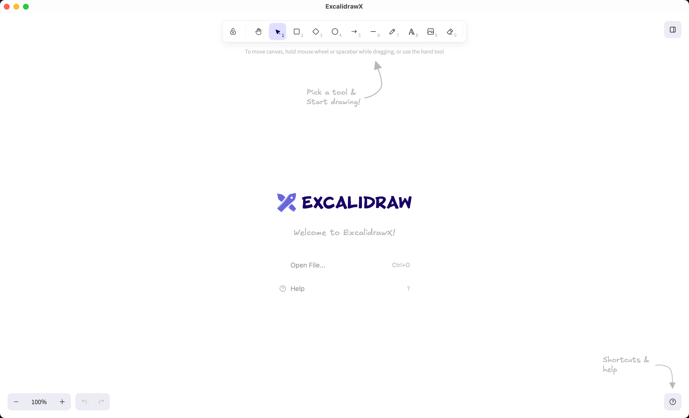

# ExcalidrawX

[](https://github.com/y8gao/excalidraw-x/actions/workflows/ci.yml)
[](LICENSE)

**Excalidraw as a native desktop app.** Same infinite canvas, hand-drawn style, and library you love — now with proper file associations, native menus, OS theme integration, and real file paths. Works offline. Feels like a first-class citizen on your operating system.



---

## Why a desktop app?

| Web version | ExcalidrawX |
|---|---|
| Runs in a browser tab | Runs as a native window |
| No file associations — can't double-click `.excalidraw` | **Double-click any `.excalidraw` file** — it just opens |
| Ctrl+S triggers browser's "Save Page" | Ctrl+S opens a **native Save dialog** at a real path |
| No recent files across sessions | **Recent files** in the menu and welcome screen |
| Theme tied to browser/system | **Auto / Light / Dark** via Window → Appearance |
| No dirty-state protection | Prompts to **Save / Discard** before losing unsaved work |
| Language follows browser | Choose any **Excalidraw locale** from the Window menu |
| Browser manages window title | Title bar shows `ExcalidrawX — filename` |

---

## Quick start

### Download (recommended)

Get the latest build for your platform from the [Releases page](https://github.com/y8gao/excalidraw-x/releases).

- **macOS:** Download the `.dmg`, drag to Applications
- **Windows:** Download the `.msi` installer
- **Linux:** Download the `.deb` or `.AppImage`

### Build from source

```bash
git clone https://github.com/y8gao/excalidraw-x.git
cd excalidraw-x
npm install
npm run dev        # launch with hot-reload
npm run package    # produce an installer for your OS
```

Requires Node 22+ and Rust. See the [Development guide](DEVELOPMENT.md) for platform-specific setup.

---

## What you get

### Real files, finally

`.excalidraw` becomes a real file type. Double-click one in Finder / Explorer / your file manager, and it opens in ExcalidrawX. Save, Save As, and Export to PNG all use **native OS file dialogs**. No more downloading your own drawings from a browser tab.

| Action | Shortcut |
|---|---|
| Open | Ctrl+O |
| Save | Ctrl+S |
| Save As | Ctrl+Shift+S |
| Export PNG | Ctrl+Shift+E |

### Never lose work

Close the window mid-sketch and ExcalidrawX asks whether to **Save**, **Discard**, or **Cancel**. Same guard when opening another file or starting a new drawing. The title bar always shows the current filename — or "Untitled" when nothing is saved yet.

### Library that persists

Import `.excalidrawlib` files, browse the public library site, and build your collection. ExcalidrawX **automatically caches** your library to disk and restores it on next launch. Save your library to share with teammates, or keep it per-machine.

| Action | Shortcut |
|---|---|
| Browse libraries | Ctrl+Alt+B |
| Import library | Ctrl+Shift+O |
| Save library | Ctrl+Alt+E |
| Toggle library panel | Ctrl+Alt+L |

### Native menu bar

Every action lives in a standard OS menu — **File**, **Edit**, **View**, **Library**, **Window**, **Help** — with platform-appropriate keyboard shortcuts. Menu checkboxes stay synced with the canvas state:

- **View mode** (Alt+R)
- **Zen mode** (Alt+Z)
- **Grid** (Ctrl+')
- **Snap to objects** (Alt+S)
- **Appearance:** Auto / Light / Dark
- **Language:** all Excalidraw built-in locales
- **Find on canvas** (Ctrl+F)
- **Command palette** (Ctrl+/)
- **Toggle sidebar** (Ctrl+B)

### Familiar canvas, better defaults

All the Excalidraw tools you know — hand-drawn shapes, arrows, text, layers, collaboration export — sized for a desktop window (1400×900). The in-app hamburger menu is hidden so actions don't appear in two places.

---

## How it works

ExcalidrawX wraps [`@excalidraw/excalidraw`](https://npmjs.com/package/@excalidraw/excalidraw) in [Tauri 2](https://v2.tauri.app/). The React frontend communicates with a Rust backend via Tauri's IPC bridge for all native operations: file dialogs, filesystem access, menu events, window management, and OS theme detection.

```
┌──────────────────────────────────────────┐
│                ExcalidrawX                │
│  ┌────────────┐    ┌───────────────────┐  │
│  │   React    │◄──►│    Rust (Tauri)   │  │
│  │  (canvas)  │IPC │  (files, menus,   │  │
│  │            │    │   window, state)  │  │
│  └────────────┘    └───────────────────┘  │
└──────────────────────────────────────────┘
```

All drawing features come from upstream Excalidraw. This repository only adds the desktop shell and integrations.

---

## License

MIT — see [LICENSE](LICENSE). Excalidraw itself is a separate project with its own license; see the [Excalidraw repository](https://github.com/excalidraw/excalidraw).
